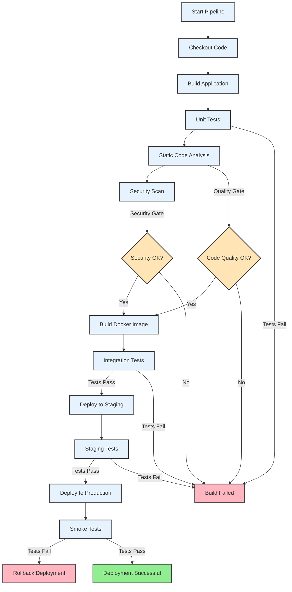

# Opis etapów pipeline'u CI/CD

## 1. Checkout Code
- Pobranie kodu z repozytorium
- Sprawdzenie odpowiedniej gałęzi
- Weryfikacja uprawnień

## 2. Build Application
- Instalacja zależności
- Kompilacja kodu
- Generowanie artefaktów

## 3. Unit Tests
- Uruchomienie testów jednostkowych
- Generowanie raportów pokrycia
- Weryfikacja wyników testów

## 4. Static Code Analysis
- Analiza jakości kodu
- Sprawdzenie standardów kodowania
- Generowanie raportów

## 5. Security Scan
- Skanowanie podatności
- Analiza zależności
- Sprawdzenie konfiguracji

## 6. Build Docker Image
- Budowanie obrazu Docker
- Tagowanie obrazu
- Weryfikacja obrazu

## 7. Integration Tests
- Testy integracyjne
- Testy API
- Testy end-to-end

## 8. Deploy to Staging
- Wdrożenie na środowisko staging
- Konfiguracja środowiska
- Weryfikacja wdrożenia

## 9. Staging Tests
- Testy na środowisku staging
- Testy wydajnościowe
- Testy obciążeniowe

## 10. Deploy to Production
- Wdrożenie na produkcję
- Aktualizacja konfiguracji
- Weryfikacja wdrożenia

## 11. Smoke Tests
- Podstawowe testy funkcjonalne
- Weryfikacja krytycznych funkcji
- Sprawdzenie dostępności

## Quality Gates
- Weryfikacja jakości kodu
- Sprawdzenie bezpieczeństwa
- Walidacja testów

## Obsługa błędów
- Automatyczny rollback w przypadku błędów
- Powiadomienia o niepowodzeniach
- Logi błędów i diagnostyka 