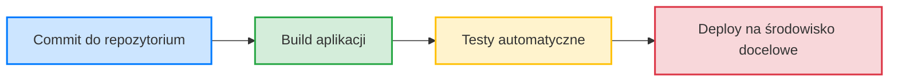

Pytanie.1
Stwórz prosty diagram Mermaid pokazujący proces CI/CD: commit → build → test → deploy.

Oczywiście! Oto prosty **diagram w notacji [Mermaid](https://mermaid.js.org/)** pokazujący proces **CI/CD**: od commit'u aż po deployment.

Możesz wkleić ten kod np. do [Mermaid Live Editor](https://mermaid.live/edit) lub do dokumentacji wspierającej Mermaid (np. README.md na GitHubie).

---

### 🔍 Co reprezentują poszczególne kroki:

* **Commit** – programista wrzuca kod do repozytorium (np. GitHub, GitLab).
* **Build** – system CI (np. Jenkins, GitHub Actions) kompiluje kod, buduje artefakty.
* **Test** – uruchamiane są testy jednostkowe/integracyjne.
* **Deploy** – kod trafia na środowisko testowe, staging lub produkcyjne.

Jeśli chcesz wersję z warunkami (np. deploy tylko po udanych testach) lub z etapami ręcznymi/approvalami – mogę ją rozbudować.

